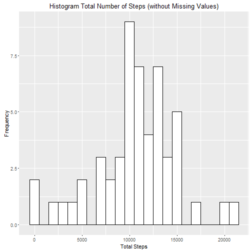
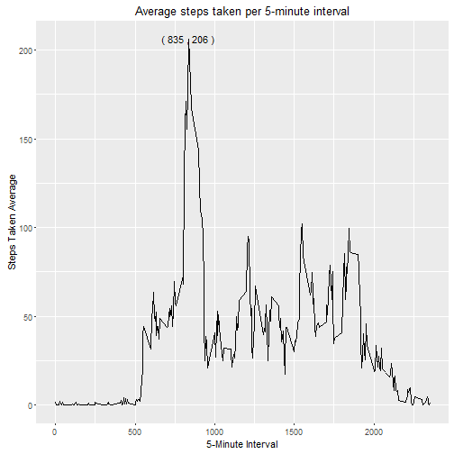
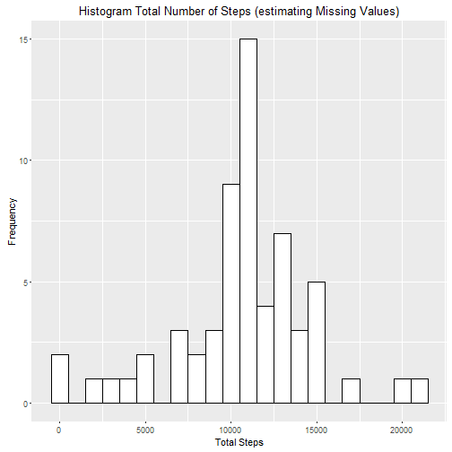
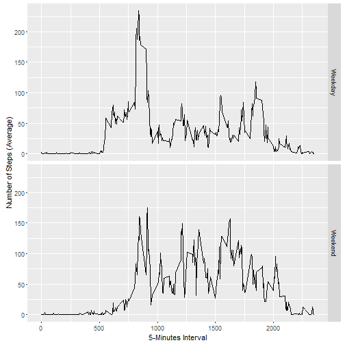

### Introduction

This is the Project 1 of the **Reproductible Research** class from **Johns Hopkins University** on **Coursera**. For details and instruction see the Readme.md file on <https://github.com/mesuarezgn/RepData_PeerAssessment1>.
  
### Loading and preprocesing the data

Show any code that is needed to: 

**1. **Load the data (i.e. read.csv())

The database used on this assignment was provided by the instructor (see repository link on the Introudction). For our purpose, the data was downloaded on 2016-09-18 17:06:04.

This is the code to download and unzip the database. Note that it includes a conditional formula to check **if** the workspace already stores the information:


```r
if(!file.exists("./data")){
  dir.create("./data")
  
  fileUrl <- "https://d396qusza40orc.cloudfront.net/repdata%2Fdata%2Factivity.zip"
  download.file(fileUrl,destfile="./data/dataset.zip")
  unzip(zipfile="./data/dataset.zip",exdir="./data")
  
}
```
Then the information was stored on the **activity** object.

```r
activity <- read.csv("./data/activity.csv")
str(activity)
```

```
## 'data.frame':	17568 obs. of  3 variables:
##  $ steps   : int  NA NA NA NA NA NA NA NA NA NA ...
##  $ date    : Factor w/ 61 levels "2012-10-01","2012-10-02",..: 1 1 1 1 1 1 1 1 1 1 ...
##  $ interval: int  0 5 10 15 20 25 30 35 40 45 ...
```

  
**2. **Process/transform the data (if necessary) into a format suitable for your analysis.

The structure of the data as is brings the **date** column as a factor, I changed it to date format for future calculations.

```r
activity$date <- as.Date(activity$date)
str(activity)
```

```
## 'data.frame':	17568 obs. of  3 variables:
##  $ steps   : int  NA NA NA NA NA NA NA NA NA NA ...
##  $ date    : Date, format: "2012-10-01" "2012-10-01" ...
##  $ interval: int  0 5 10 15 20 25 30 35 40 45 ...
```

### What is mean total number of steps taken per day?

**1. **Calculate the total number of steps taken per day.

Following the instructions for this assignment, the missing values were ignored. A separate dataset was created removing the **NA** values and **sumarizing the number of steps taken by date**. The new object was named **dailyStepsSummary**.


```r
dailyStepsSummary <- activity[complete.cases(activity),] # Removes the missing values
dailyStepsSummary <- aggregate(dailyStepsSummary$steps, 
                               by=list(dailyStepsSummary$date), 
                               FUN=sum)
names(dailyStepsSummary) <- c("date", "totalSteps")
head(dailyStepsSummary)
```

```
##         date totalSteps
## 1 2012-10-02        126
## 2 2012-10-03      11352
## 3 2012-10-04      12116
## 4 2012-10-05      13294
## 5 2012-10-06      15420
## 6 2012-10-07      11015
```

**2. **Make a histogram of the total number of steps taken each day.

```r
library(ggplot2)
```

```
## Warning: package 'ggplot2' was built under R version 3.1.3
```

```r
ggplot(dailyStepsSummary, aes(x=totalSteps)) +
  geom_histogram(binwidth = 1000, fill="white", color="black") +
  xlab("Total Steps") + ylab("Frequency") + 
  ggtitle("Histogram Total Number of Steps (without Missing Values)")
```



**3. **Calculate and report the mean and median of the total number of steps taken per day.

```r
round(mean(dailyStepsSummary$totalSteps),0)
```

```
## [1] 10766
```


```r
round(median(dailyStepsSummary$totalSteps),0)
```

```
## [1] 10765
```


### What is the average daily activity pattern?

To answer this question, it was necessary to reshape the data to capture the average steps across all days per 5-minute interval. The new data was saved on the **intervalSummary** object.


```r
intervalSummary <- aggregate(activity$steps, by=list(activity$interval), FUN=mean, na.rm=TRUE)
names(intervalSummary) <- c("interval", "avgsteps")
head(intervalSummary)
```

```
##   interval  avgsteps
## 1        0 1.7169811
## 2        5 0.3396226
## 3       10 0.1320755
## 4       15 0.1509434
## 5       20 0.0754717
## 6       25 2.0943396
```
The following script extract **the 5-minute interval that contains the maximum number of steps (on average across all the days in the dataset)**.

```r
maxInterval <- intervalSummary[intervalSummary$avgsteps == max(intervalSummary$avgsteps),]
maxInterval
```

```
##     interval avgsteps
## 104      835 206.1698
```
The following **time series plot** shows the 5-minute interval (x-axis) and the average number of steps taken, averaged across all days (y-axis).

```r
ggplot(intervalSummary, aes(x = interval, y = avgsteps)) + 
  geom_line() + xlab("5-Minute Interval") + ylab("Steps Taken Average") + 
  ggtitle("Average steps taken per 5-minute interval") + 
  geom_text(data=subset(intervalSummary, avgsteps == max(avgsteps)),
            aes(label = paste("( ", interval, " , ", round(avgsteps), " )", sep = "")))
```



### Imputing missing values

**1. **Calculate and report the total number of missing values in the dataset (i.e. the total number of rows with NAs).


```r
nNA <- sum(!complete.cases(activity))
nNA
```

```
## [1] 2304
```

**2. **Devise a strategy for filling in all of the missing values in the dataset. The strategy does not need to be sophisticated. For example, you could use the mean/median for that day, or the mean for that 5-minute interval, etc.

Since I already have a dataset with the average steps per interval **intervalSummary**, I used this criteria to fill in all the missing values.

**3. **Create a new dataset that is equal to the original dataset but with the missing data filled in.


```r
activityNonNA <- activity
activityNonNA$steps[is.na(activityNonNA$steps)] <- 
  intervalSummary$avgsteps[intervalSummary$interval == intervalSummary$interval]
head(activityNonNA)
```

```
##       steps       date interval
## 1 1.7169811 2012-10-01        0
## 2 0.3396226 2012-10-01        5
## 3 0.1320755 2012-10-01       10
## 4 0.1509434 2012-10-01       15
## 5 0.0754717 2012-10-01       20
## 6 2.0943396 2012-10-01       25
```

**4. **Make a histogram of the total number of steps taken each day and Calculate and report the mean and median total number of steps taken per day. Do these values differ from the estimates from the first part of the assignment? What is the impact of imputing missing data on the estimates of the total daily number of steps?


```r
# First, I created the summary of the data
activityNonNASummary <- aggregate(activityNonNA$steps, 
                               by=list(activityNonNA$date), 
                               FUN=sum)
names(activityNonNASummary) <- c("date", "totalSteps")

# This is the code for the histogram using the summarized data
ggplot(activityNonNASummary, aes(x=totalSteps)) +
  geom_histogram(binwidth = 1000, fill="white", color="black") +
  xlab("Total Steps") + ylab("Frequency") + 
  ggtitle("Histogram Total Number of Steps (estimating Missing Values)")
```




```r
round(mean(activityNonNASummary$totalSteps),0)
```

```
## [1] 10766
```


```r
round(median(activityNonNASummary$totalSteps),0)
```

```
## [1] 10766
```

**Answer:** The mean and median don't differ from the estimate from the first part of the assigment, both data set have a normal distribution.

### Are there differences in activity patterns between weekdays and weekends?

**1. **Create a new factor variable in the dataset with two levels - "weekday" and "weekend" indicating whether a given date is a weekday or weekend day.


```r
activity2 <- activity
weekendStr <- c("Saturday", "Sunday")
weekdayStr <- c("Monday", "Tuesday", "Wednesday", "Thursday", "Friday")
activity2$daytype <- weekdays(activity2$date)
activity2$daytype[activity2$daytype %in% weekendStr] <- "Weekend"
activity2$daytype[activity2$daytype %in% weekdayStr] <- "Weekday"
activity2$daytype <- as.factor(activity2$daytype)
str(activity2)
```

```
## 'data.frame':	17568 obs. of  4 variables:
##  $ steps   : int  NA NA NA NA NA NA NA NA NA NA ...
##  $ date    : Date, format: "2012-10-01" "2012-10-01" ...
##  $ interval: int  0 5 10 15 20 25 30 35 40 45 ...
##  $ daytype : Factor w/ 2 levels "Weekday","Weekend": 1 1 1 1 1 1 1 1 1 1 ...
```

**2. **Make a panel plot containing a time series plot (i.e. type = "l") of the 5-minute interval (x-axis) and the average number of steps taken, averaged across all weekday days or weekend days (y-axis). See the README file in the GitHub repository to see an example of what this plot should look like using simulated data.


```r
# Sumarizes the data
daytypeSummary <- aggregate(activity2$steps, 
                            by=list(activity2$daytype, activity2$interval), 
                            FUN=mean, na.rm=TRUE)
names(daytypeSummary) <- c("daytype", "interval", "avgsteps")

# Creates the panel plot using ggplot2
ggplot(daytypeSummary, aes(x=interval, y=avgsteps)) +
  geom_line()+facet_grid(daytype~.) + 
  xlab("5-Minutes Interval") + ylab("Number of Steps (Average)")
```




